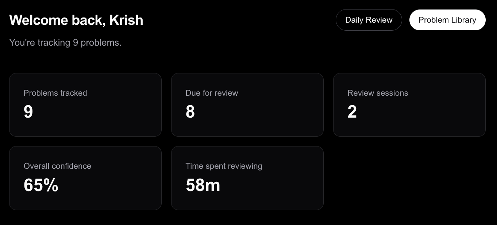
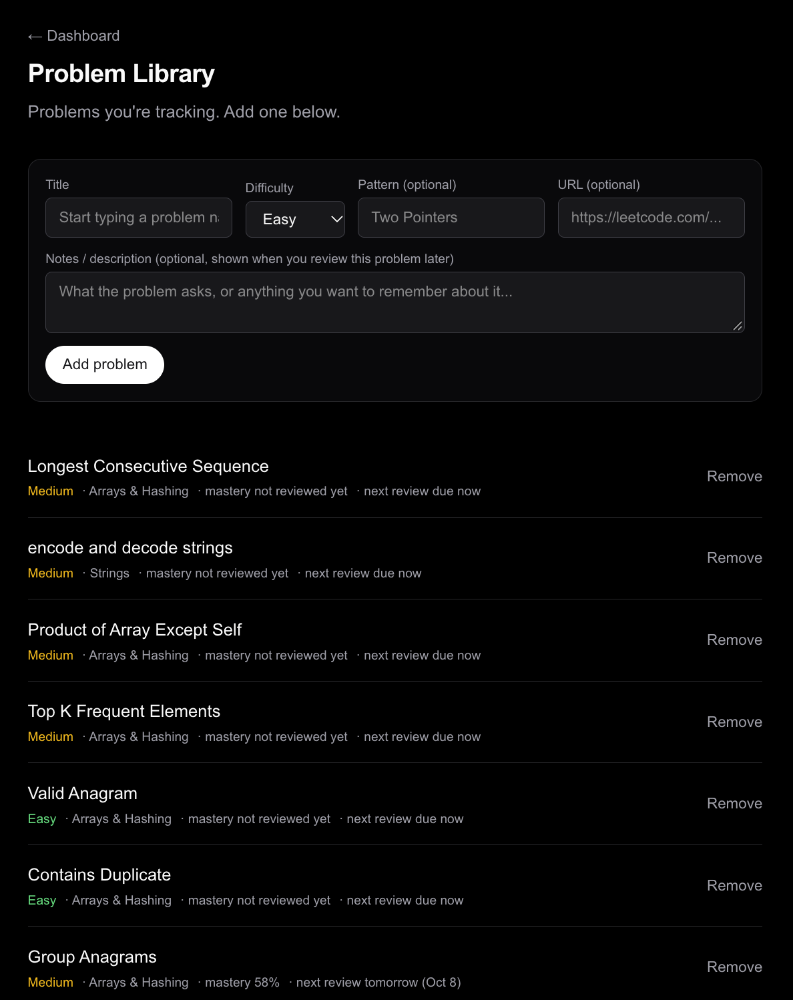
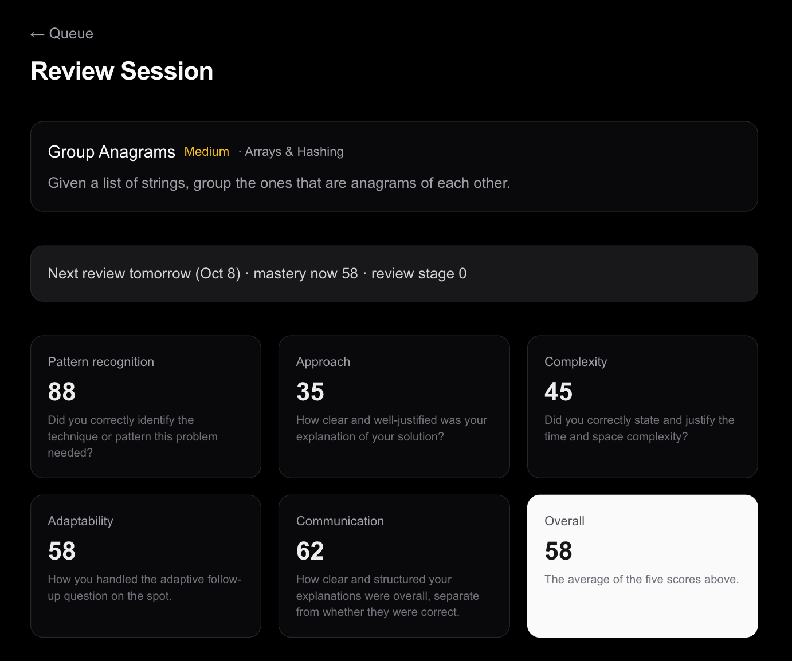
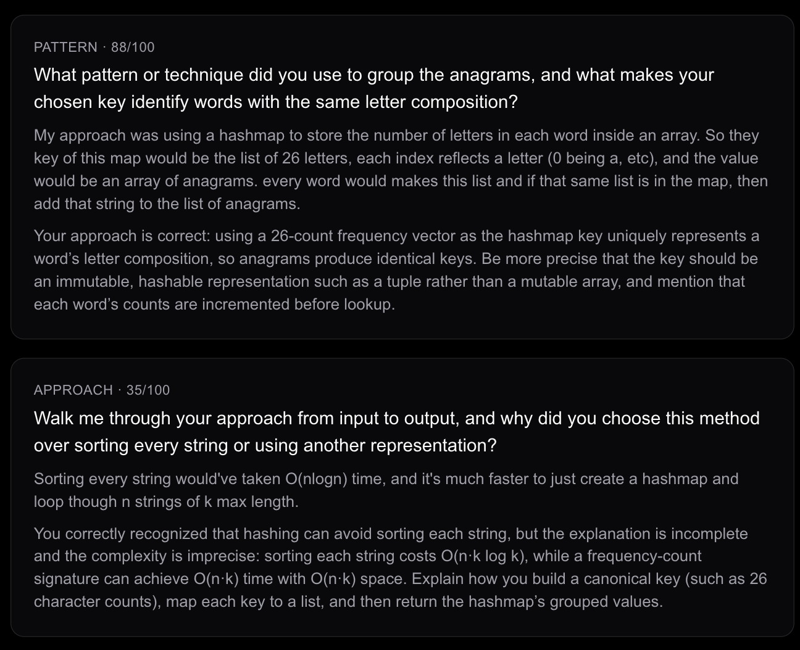
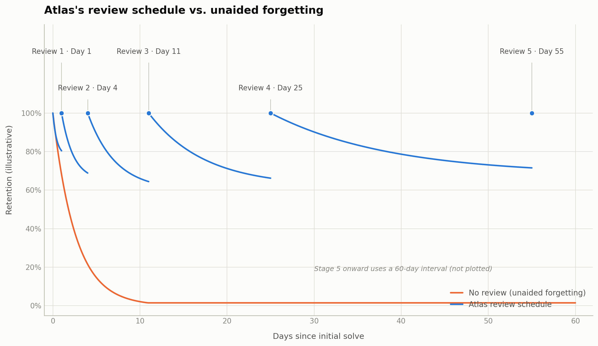

# Atlas

An AI-powered spaced-repetition app for LeetCode review, built to solve a real problem: solving 300+ problems and still forgetting how half of them work a few weeks later.

Most spaced-repetition tools are built for flashcards and static facts. Atlas is built for procedural, pattern-based knowledge instead. Given a problem you've solved before, can you still recognize which approach it needs, reason through the complexity, and explain your thinking out loud, without re-reading your old solution?

## How it works

- Add problems you've solved, either from a built-in catalog or as custom entries.
- When a problem comes up for review, Atlas generates adaptive questions with OpenAI covering pattern recognition, approach, time/space complexity, and communication, then asks a follow-up targeted at wherever your answer was weakest.
- Each answer is graded across five dimensions, and the result feeds a spaced-repetition scheduler that adjusts when the problem comes back: stronger sessions push it further out, weaker ones bring it back sooner.
- A dashboard tracks review stats, mastery over time, and recent activity.

## Screenshots

<table>
<tr>
<td width="50%"><br><sub>Dashboard</sub></td>
<td width="50%"><br><sub>Problem Library</sub></td>
</tr>
<tr>
<td colspan="2"><br><sub>Review results, five score dimensions</sub></td>
</tr>
</table>

Sample AI feedback from a graded answer, showing what the grading actually looks like rather than just the score:



## The spacing algorithm

Atlas uses a fixed six-stage interval ladder (1 / 3 / 7 / 14 / 30 / 60 days) rather than a continuous SM-2-style algorithm. A problem's `reviewStage` advances on a score of 70+, holds steady between 50 and 70, and falls back below 50, and each stage maps to a wider gap before the next review. A separate mastery score, an exponential moving average weighted toward the most recent session, tracks long-term proficiency independent of the current stage.



*Illustrative, not measured telemetry: it shows the shape the schedule is designed to produce, not retention data collected from real sessions.*

## Tech stack

- Next.js 16 (App Router), React 19, TypeScript, Tailwind CSS
- Clerk for authentication
- PostgreSQL (Supabase) via Prisma ORM
- OpenAI API for question generation and grading

## Architecture

- `app/` – UI only, no business logic
- `app/api/` – thin REST route handlers: parse the request, call a service, return JSON
- `services/` – all business logic; the only layer that talks to Prisma
- `prisma/schema.prisma` – data model: User, Problem, UserProblem, ReviewSession, Question

A few decisions worth calling out:

- **`Problem` and `UserProblem` are separate models.** `Problem` is canonical, shared data (title, difficulty, pattern); `UserProblem` is one user's personal tracking state (mastery, schedule, notes) for that problem. This lets the same problem be tracked differently by different users without duplicating problem data.
- **AI never touches the database directly.** OpenAI generates questions and grades, but `services/review.ts` is the only thing that persists what comes back. That keeps a malformed or unexpected model response from being able to corrupt state on its own.
- **The scheduler is a fixed ladder, not a dynamic algorithm.** A full SM-2-style per-problem expansion factor was considered and intentionally skipped for now in favor of something simpler to reason about at this scale; revisiting it is on the roadmap below.

## Getting started

```bash
npm install
# add your own DATABASE_URL, Clerk keys, and an OpenAI API key to .env.local
npx prisma generate
npx prisma db push
npm run dev
```

## Testing

```bash
npm test
```

Unit tests cover the spaced-repetition scheduling and mastery-scoring logic (19 tests, scheduler and mastery services).

## Status

Auth, the problem library, the daily review queue, AI-graded review sessions, spaced repetition, and the dashboard are built and merged into main.

Not done yet: deployment, caching on the dashboard stats query, moving the OpenAI calls off the request/response cycle, broader test coverage, and a real load test. Also on the list: a way for a problem to graduate out of rotation instead of recurring forever, and expanding the problem catalog past its current curated set.
